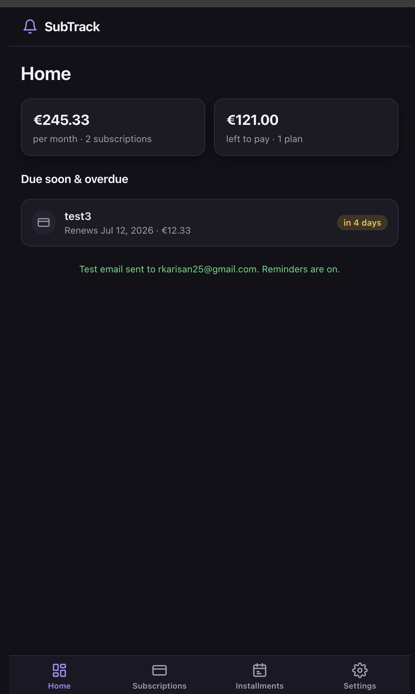
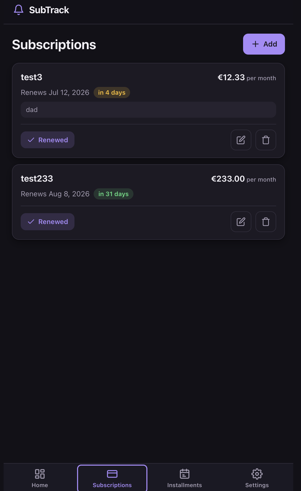
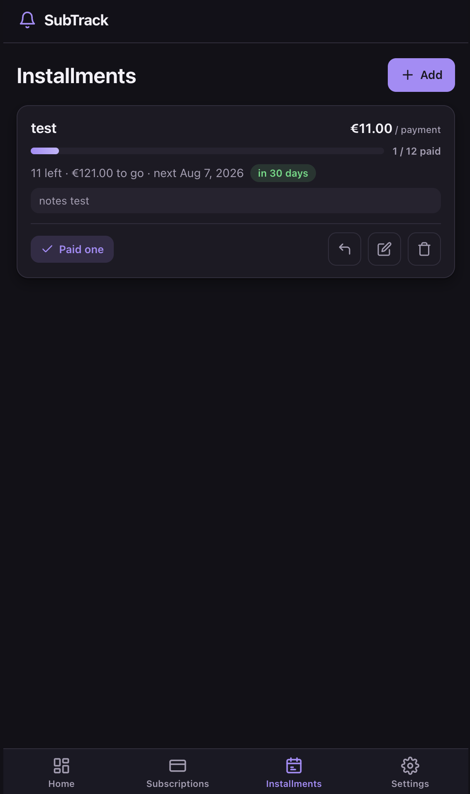
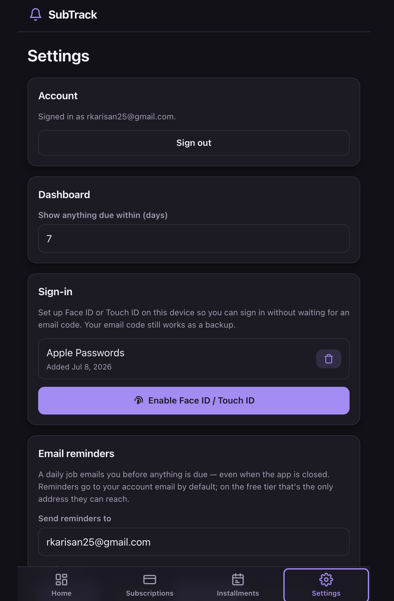

# SubTrack — Subscriptions & Installments

A phone-first PWA to track **subscription renewals** (so you can cancel
in time) and **installment plans** (so you can see how many payments are left) —
and it **emails you a reminder before anything is due, even when the app is
closed**.

## ▶️ Try it now — no install, no setup

**Live app: [ramazankarisan.github.io/subscription-tracker](https://ramazankarisan.github.io/subscription-tracker/)**

Anyone can use it in under a minute — you don't need to be a developer:

1. Open the link on your phone or laptop.
2. Enter **your real email** and tap **Email me a code** (or use Face ID / Touch ID
   after your first sign-in). No password, no account to create.
3. Paste the 6-digit code from your inbox — you're in.
4. Add a subscription or installment, then tap **Send me a test email** on the
   Home screen to get a real reminder in your own inbox right away.

Reminders then arrive automatically before anything is due — even with the app closed.

> **Where your data lives (please read).** The live app above is **my** hosted
> instance. Your subscriptions, installments and email are stored in **my
> Supabase project**, which means **I (the owner) can see your data** in that
> database — other _users_ can't (row-level security isolates accounts from each
> other), but the project owner and the reminder job read every row. Don't put
> anything sensitive in it. **Want a fully private copy that only you control?
> [Fork it and run your own](#make-it-yours-fork--own-instance)** with your own
> Supabase + Brevo — then nobody but you can see your data.

## Screenshots

|                                          Home                                           |                                      Subscriptions                                      |                                     Installments                                      |                                         Settings                                          |
| :-------------------------------------------------------------------------------------: | :-------------------------------------------------------------------------------------: | :-----------------------------------------------------------------------------------: | :---------------------------------------------------------------------------------------: |
|  |  |  |  |

## Highlights

- **Passwordless sign-in, any way you like** — a one-time **email code**, a
  **magic link**, or **Face ID / Touch ID** (passkey) after your first sign-in.
  No password, no account to create.
- **Your data syncs live across devices** — stored per-user in Supabase
  (Postgres); an edit on your phone shows up on your laptop within seconds
  (Supabase Realtime) or the moment that tab regains focus, no reload needed.
  A write that can't reach the server surfaces a notice instead of silently
  vanishing.
- **Server-scheduled email reminders** — a daily job emails you at your chosen
  offsets (default **3 days before** and **on the due date**), sent from the
  server via [Brevo](https://www.brevo.com) so it works even when the app is shut.
- **Installable** — add it to your phone's home screen like a real app (PWA).
- **Free & multi-user** — runs entirely on free tiers; anyone can sign in and
  reminders reach their own inbox.

## Stack

Vite + React 19 + TypeScript · `date-fns` · `vite-plugin-pwa` ·
[`@supabase/supabase-js`](https://supabase.com) (Postgres + passwordless auth —
email code / magic link + passkey — Row Level Security + a Deno **Edge Function**
on a daily **Cron**) ·
[Brevo](https://www.brevo.com) for email · hosted on **GitHub Pages**.

The store (`src/state/useAppData.tsx`) reads/writes Supabase per user, with a
localStorage copy kept as an offline cache. Architecture details: see `CLAUDE.md`.

## Run it locally

```bash
pnpm install
cp .env.example .env     # then fill in VITE_SUPABASE_URL + VITE_SUPABASE_PUBLISHABLE_KEY
pnpm dev                 # http://localhost:5173
pnpm build               # production build into dist/ (also generates PWA icons)
pnpm preview             # serve the production build

pnpm lint                # eslint (strict TS + React + curly + no-abbreviations)
pnpm dupes               # jscpd copy-paste detector
pnpm typecheck           # tsc -b --noEmit
pnpm knip                # unused files/deps
pnpm secretlint          # scan for committed secrets
pnpm format              # prettier --write .
```

## Make it yours (fork = own private instance)

Prefer that **nobody but you** can see your data? Run your own copy. Everything
here is **free-tier** — no cost to host.

1. **Fork** this repo to your own GitHub account.
2. Create your **own** Supabase project + **Brevo** account (both free) and follow
   **[`docs/supabase-setup.md`](docs/supabase-setup.md)** — it's click-by-click.
3. Put _your_ `VITE_SUPABASE_*` values in the repo's Actions **Variables**; push to
   `main` and GitHub Pages serves your instance at your own URL.

Now the database, the auth, and the reminder emails are **entirely yours** — your
data sits in _your_ Supabase project, and only you (its owner) can read it. Nothing
flows through my instance.

The trade-off is simple: **my hosted app** costs you nothing and needs no setup,
but I (the project owner) can see your data. **Your fork** is also free and takes
one-time Supabase + Brevo setup, after which only you can see your data.

## Setup (one-time)

You need a Supabase project + Brevo account first.

Full click-by-click instructions — Supabase project, database schema, Brevo key,
the reminder Edge Function, the daily cron, and GitHub Pages variables — are in
**[`docs/supabase-setup.md`](docs/supabase-setup.md)**.

## Deploy / use on your phone (no App Store)

Every push to `main` builds and publishes to **GitHub Pages** via
`.github/workflows/deploy.yml` (the two `VITE_SUPABASE_*` values come from repo
**Settings → Actions → Variables**). Then, on the live URL
`https://ramazankarisan.github.io/subscription-tracker/`:

- **iOS Safari:** Share → _Add to Home Screen_.
- **Android Chrome:** menu → _Install app_ / _Add to Home screen_.

> A PWA needs HTTPS (GitHub Pages provides it) for the service worker. Make sure
> the Pages URL is in Supabase → Authentication → **URL Configuration** so magic
> links return to the app.

## Email reminders

Reminders are sent **server-side** (no per-user email keys). In **Settings** you
choose _when_ (chips: on the day / 1 / 3 / 7 days before) and _which inbox_.

> Brevo's free tier (300 emails/day) sends to **any** recipient from a single
> **verified sender** — no domain needed — so every signed-in user gets their own
> reminders. Mail from a plain address (no domain DKIM) can land in spam; a
> verified domain in Brevo fixes deliverability later with no code change.

## How dates work

- **Subscriptions** have a next-renewal date and a billing cycle. "Renewed"
  advances the date by one cycle (skipping any cycles already in the past).
- **Installments** compute the next payment as
  `firstPaymentDate + paidPayments × interval`. "Paid one" increments the paid
  count; "Undo" decrements it.
- A reminder fires when today is within a short catch-up window of
  `dueDate − offset` for each configured offset; the `reminder_log` table ensures
  each one is emailed at most once.

## Backup

Settings → Backup exports all your data to a JSON file and re-imports it.

## Contributing / workflow

Changes land on `main` **only via a pull request** (never a direct push). See the
workflow notes in `CLAUDE.md`; git hooks (lefthook) and CI enforce lint, format,
typecheck, knip, secretlint, and build.
